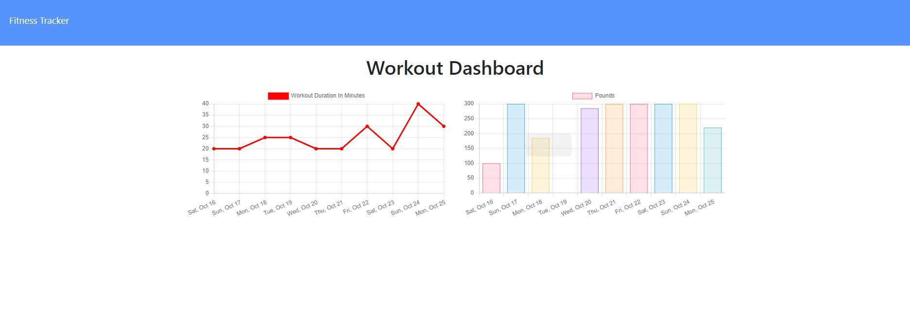

# Workout Tracker

# Table of Contents

[Description](#description) -
[Usage](#usage) - 
[Technologies](#technologies) -
[Links](#links) - 
[Contact](#contact) -
[Technologies](#technologies) -
[License](#license)

## Description

This app is a workout tracker where you can track your progress across different workouts, with each exercise you do. For this assignment the task was to build the backend of the app as well as the models for a MongoDB database using the NPM package Mongoose. The models overall were pretty simple to make, the hardest part being breaking down the front end HTML to see what all needed to be able to be stored in a document. 

## Install

Please use **'npm i'** in the command line to install the dependencies. This program uses MongoDB, Mongoose, and ExpressJS.

After this use the command **'npm run seed'** to seed the database with information, if you wish to see the application working.

## Usage

When ready use **'npm start'** into the command line to run.

## Links

[Walkthrough Video](https://youtu.be/oodqfjc33yU)  
[Deployed App](https://whispering-citadel-87887.herokuapp.com/)  
[GitHub](https://github.com/niklasertle/workout-tracker)

## Contact

[GitHub Profile](https://github.com/niklasertle) 
[Email Me](mailto:nik.ertle16@gmail.com)

## Technologies

## License

[MIT License Copyright (c) 2021 niklasertle](LICENSE)
